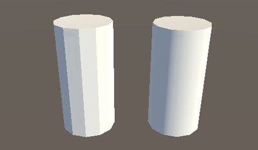
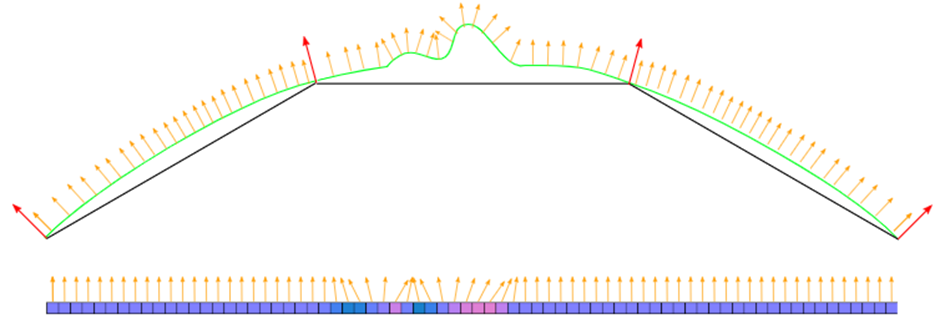
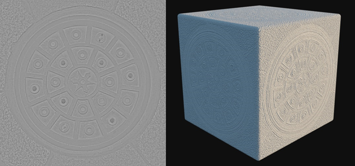
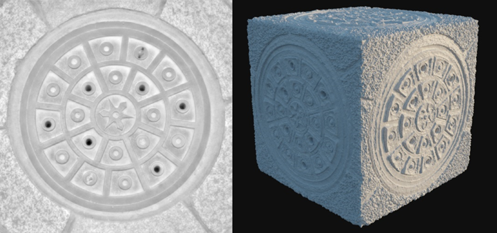
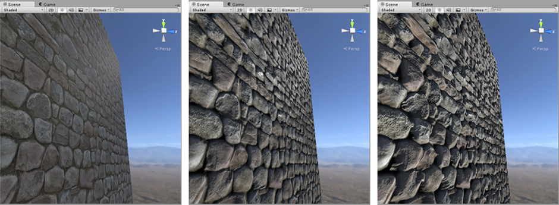

Normal maps are a type of Bump Map. They are a special kind of texture that allow you to add surface detail such as bumps, grooves, and scratches to a model which catch the light as if they are represented by real geometry.

To really explain how normal mapping works, we will first describe what a “normal” is, and how it is used in realtime lighting. Perhaps the most basic example would be a model where each surface polygon is lit simply according to the surface angles relative to the light. The surface angle can be represented as a line protruding in a perpendicular direction from the surface, and this direction (which is a vector) relative to the surface is called a “surface normal”, or simply, a normal.

The model on the right has the same number of polygons as the model on the left, however the shading appears smooth - the lighting across the polygons gives the appearance of a curved surface. Why is this? The reason is that the surface normal at each point used for reflecting light gradually varies across the width of the polygon, so that for any given point on the surface, the light bounces as if that surface was curved and not the flat constant polygon that it really is.

The surface normals are represented by the orange arrows. These are the values used to calculate how light reflects off the surface, so you can see that light will respond the same across the length of each polygon, because the surface normals point in the same direction. This gives the “flat shading”, and is the reason the left cylinder’s polygons appear to have hard edges.

For the smooth shaded cylinder however, the surface normals vary across the flat polygons, as represented here:

The normal directions gradually change across the flat polygon surface, so that the shading across the surface gives the impression of a smooth curve (as represented by the greeen line). This does not affect the actual polygonal nature of the mesh, only how the lighting is calculated on the flat surfaces. This apparent curved surface is not really present, and viewing the faces at glancing angles will reveal the true nature of the flat polygons, however from most viewing angles the cylinder appears to have a smooth curved surface.

Using this basic smooth shading, the data determining the normal direction is actually only stored **per** **vertex**, so the changing values across the surface are interpolated from one vertex to the next. In the diagram above, the red arrows indicate the stored normal direction at each vertex, and the orange arrows indicate examples of the interpolated normal directions across the area of the polygon.

Normal mapping takes this modification of surface normals one step further, by using a texture to store information about how to modify the surface normals across the model. A normal map is an image texture mapped to the surface of a model, similar to regular colour textures, however each pixel in the texture of the normal map (called a texel) represents a deviation in surface normal direction away from the “true” surface normal of the flat (or smooth interpolated) polygon.

## Normal Maps & Bump Maps

Normal and bump maps create the appearance of additional surface detail by changing normals at render time, without actually creating additional geometry. This makes them faster and use less memory.

**Bump** **maps** store height deltas as grey levels in a monochrome map.

**Normal** **maps** store vectors as RGB in a color map.

Because they only change the normal, they **do not affect the silhouette** of the object. For example, if you add normal mapping to a sphere, you can make the surface area of the sphere look rough and craggy, but the edges will still be perfectly smooth.

### Why the bluey-purple colours?

Understanding this is not vital for using normal maps! It’s ok to skip this paragraph. However if you really want to know: The RGB colour values are used to store the X,Y,Z direction of the vector, with Z being “up” (contrary to Unity’s usual convention of using Y as “up”). In addition, the values in the texture are treated as having been halved, with 0.5 added. This allows vectors of all directions to be stored. Therefore, to convert an RGB colour to a vector direction, you must multiply by two, then subtract 1. For example, an RGB value of (0.5, 0.5, 1) or #8080FF in hex results in a vector of (0,0,1) which is “up” for the purposes of normal-mapping - and represents no change to the surface of the model. This is the colour you see in the flat areas of the “example” normal map earlier on this page.

So the colour defines the amount on each axis

X: -1 to +1 : Red: 0 to 255
Y: -1 to +1 : Green: 0 to 255
Z: 0 to 1 : Blue: 128 to 255 <- notice difference

So if you take a totally flat surface, this would be considered (0, 0, 1),  
which would map to 128, 128, 255

### Normal Vector Spaces

**Tangent space**
Stores the normal relative to the tangent space of the surface. Normals will still look right when the surface deforms, like the skin of an  animated character.

**World space**
Stores normals relative to world space. If the surface moves or deforms, it will appear to swim through a texture anchored in place. You should generally only this for static geometry. World space maps preserve sharp cusps better than tangent-space maps.

**Object space**
Stores normals relative to the object transform. Objects can move, but if they deform the normals will not look right.
### How do I get or make normal maps?

Commonly, Normal Maps are produced by 3D or Texture artists in conjunction with the model or textures they are producing, and they often mirror the layout and contents of the Albedo map. Sometimes they are produced by hand, and sometimes they are rendered out from a 3D application.

How to render normal maps from a 3D application is beyond the scope of this documentation, however the basic concept is that a 3D artist would produce two versions of a model - a very high resolution model containing all detail as polygons, and a lower-res “game ready” model. The high res model would be too detailed to run optimally in a game (too many triangles in the mesh), but it is used in the 3D modelling application to generate the normal maps. The lower-res version of model can then omit the very fine level of geometry detail that is now stored in the normal maps, so that it can be rendered using the normal mapping instead. A typical use case for this would be to show the bumped detail of creases, buttons, buckles and seams on a characters clothing.

There are some software packages which can analyse the lighting in a regular photographic texture and extract a normal map from it. This works by assuming the original texture is lit from a constant direction, and the light and dark areas are analysed and assumed to correspond with angled surfaces. However, when actually using a bump map, you need to make sure that your Albedo texture _does not_ have lighting from any particular direction in the image - ideally it should represent the colours of the surface with no lighting at all - because the lighting information will be calculated by Unity according to the light direction, surface angle and bump map information.

## Heightmap (displacement map)

Height mapping (also known as parallax mapping) is a similar concept to normal mapping, however this technique is more complex - and therefore also more performance-expensive. Heightmaps are usually used in conjunction with normal maps, and often they are used to give extra definition to surfaces where the texture maps are responsible for rendering large bumps and protrusions.

While normal mapping modifies the lighting across the surface of the texture, parallax height mapping goes a step further and shifts the areas of the visible surface texture around, to achieve a kind of surface-level occlusion effect. This means that apparent bumps will have their near side (facing the camera) expanded and exaggerated, and their far side (facing away from the camera) will be reduced and seem to be occluded from view.

This effect, while it can produce a very convincing representation of 3D geometry, is still limited to the surface of the flat polygons of an object’s mesh. This means that while surface bumps will appear to protrude and occlude each other, the “silhouette” of the model will never be modified, because ultimately the effect is drawn onto the surface of the model and does not modify the actual geometry.

Displacement maps add new geometry at render time. The renderer subdivides the existing geometry and the moves it according to the texture values. Displace Along Normal stores height deltas, similar to bump maps. Vector Displacement stores offset vectors as RGB. The vectors can be in tangent, object, or world space. 

In contrast to Displace Along Normal, this allows parts of a surface to arch over neighbouring parts.

A heightmap should be a greyscale image, with white areas representing the high areas of your texture and black representing the low areas. Here’s a typical albedo map and a heightmap to match.

Left = only diffuse
Middle = normal map
Right = height map

